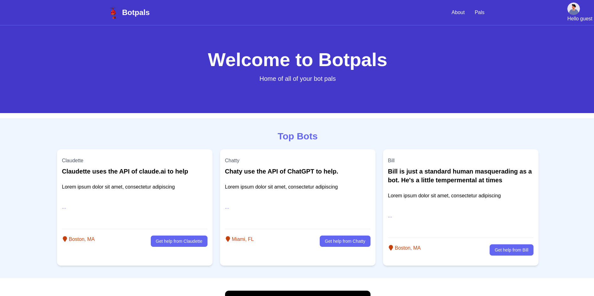
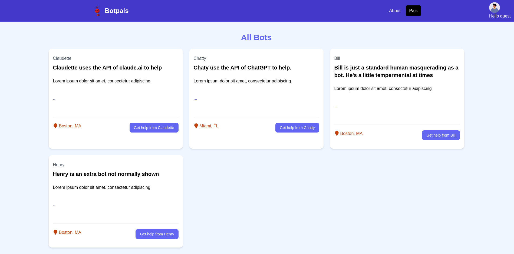

# Botpals
AI Chatbot using nodejs, react, vite, and tailwind css

## Frontend

If you're using npm, you can do the following

```bash
npm install #install packages for react frontend
npm run dev # start a development server to hot reload the frontend on file change
```

The frontend react server runs on port 3001 as defined in `vite.config.ts`

## Server

If you're using pipenv, you can simply run `pipenv run server` while developing. The server runs on port 5000 by default

## Progress as of 4-18-2024




